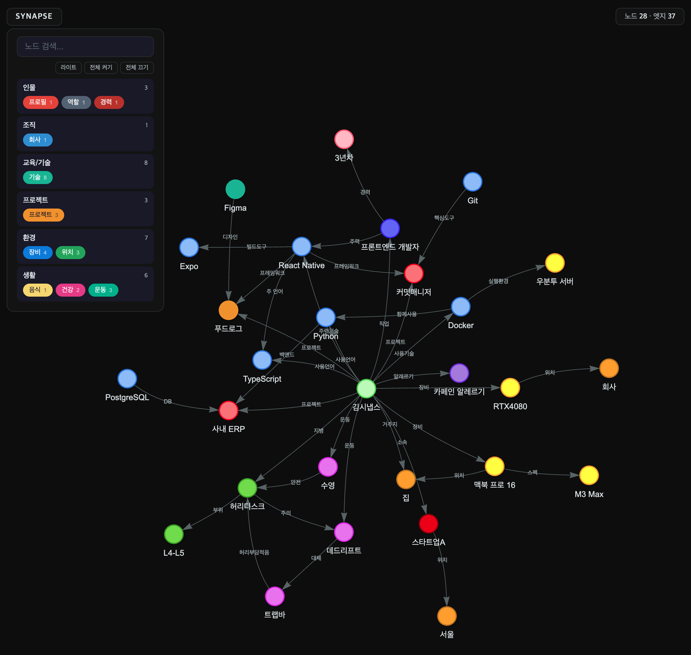

# Synapse

개인 정보를 그래프로 구조화해두고, 질문에 맞는 맥락만 골라서 LLM 프롬프트를 만들어주는 엔진.



## 왜 필요한가

Claude에게 "운동 추천해줘"라고 물으면, 일반적인 운동 목록을 준다.
하지만 나는 허리디스크가 있고, 데드리프트를 하다가 재발한 적이 있다.

**Synapse가 없으면:**
```
나: 운동 추천해줘
AI: 스쿼트, 데드리프트, 벤치프레스를 추천합니다.
```

**Synapse가 있으면:**
```
나: 운동 추천해줘
AI: L4-L5 허리디스크 이력이 있으시네요. 데드리프트 대신 트랩바를 추천드리고,
    수영은 허리에 부담 없이 전신 운동이 가능합니다.
```

나에 대한 정보가 들어가면, 모든 답변이 달라진다.

## 아키텍처

```
synapse/core/     ← npm 패키지 (@synapse/core). LLM 없음. 순수 로직.
poomacy-v2/       ← React 앱. NLI + AI Chat. @synapse/core import.
claude code/      ← Python 스킬. 같은 DB 사용.
```

Synapse = 맥락 저장소 + 맥락 제공 엔진. 채팅 앱이 아님.
Core만 패키지로 분리. 채팅/온보딩/구조화는 소비자 앱이 담당.

## 어떻게 동작하나

```
질문 → 키워드 정규화 → aliases/노드명 매칭 → 정방향 BFS → 프롬프트 조립 → LLM 답변
```

- 정방향 BFS만. 본인 노드 경유 차단.
- 연결된 시작 노드끼리 교집합 (AND), 비연결은 합집합 (OR).
- 도메인 키워드 있으면 해당 도메인 결과만 유지.
- 매칭 실패 시 missing 정보 반환 ("건강 관련 노드가 없습니다").

## DB 스키마 (v5)

```sql
nodes:        id, name, domain, status(active|inactive), source, weight, safety, safety_rule
edges:        id, source_node_id, target_node_id, type, label, last_used
aliases:      alias, node_id
filters:      id, name
filter_rules: filter_id, domain, node_id, action(exclude)
```

모든 데이터는 로컬 `~/.synapse/synapse.db`에 저장. 서버에 올라가지 않는다.

## TypeScript Core (@synapse/core)

```typescript
import { createSynapse } from '@synapse/core';
const synapse = createSynapse('~/.synapse/synapse.db');

// 맥락 조회
synapse.search.getContext("맥미니 개발환경");

// 노드/엣지 추가
synapse.store.addBatch({ nodes: [...], edges: [...] });

// 조회
synapse.store.listDomains();
synapse.store.showNode("React Native");
```

브라우저용 `SqlJsAdapter`, Node.js용 `BetterSqliteAdapter` 제공.

## Claude Code 스킬

| 스킬 | 설명 |
|------|------|
| `/context` | 질문에 맞는 맥락을 그래프에서 찾아 답변에 반영 |
| `/save` | 대화에서 개념과 관계를 추출하여 그래프에 저장 |
| `/list` | 저장된 노드/엣지/도메인 조회 |
| `/update` | 노드 수정, 비활성화, 복원 |
| `/visualize` | 인터랙티브 그래프 뷰를 브라우저에서 열기 |

## CLI

```bash
./synapse "이력서 만들어줘"                    # 맥락 자동 주입 + 질문
python3 scripts/get_context.py "질문"          # 맥락 프롬프트만 추출
python3 scripts/add_nodes.py '<json>'          # 노드/엣지 추가
python3 scripts/list_nodes.py nodes            # 노드 목록
python3 scripts/list_nodes.py domains          # 도메인 요약
python3 scripts/update_node.py deactivate "X"  # 비활성화
python3 scripts/visualize.py                   # 그래프 뷰
```

## 설치

### Claude Code 플러그인
```bash
/plugin marketplace add hiyong7759/synapse
/plugin install synapse@synapse
```

### npm 패키지 (브라우저/Node.js)
```bash
cd synapse/core && npm install && npm run build
npm install ../synapse/core  # 소비자 앱에서
```

## 요구사항

- Python 3.10+ (Claude Code 스킬용)
- Node.js 18+ (TypeScript Core용)
- SQLite (기본 내장)

## 라이선스

MIT
